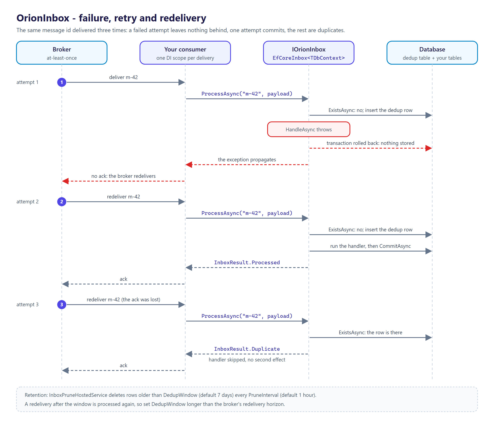

<p align="center">
  <picture>
    <source media="(prefers-color-scheme: dark)" srcset="docs/logo.png">
    
  </picture>
</p>

# OrionInbox

[](https://github.com/tunahanaliozturk/OrionInbox/actions/workflows/ci-cd.yml)
[](https://www.nuget.org/packages/OrionInbox/)
[](LICENSE)


The consumer-side other half of [OrionPatch](https://github.com/tunahanaliozturk/OrionPatch): a transactional **inbox** that makes a message's *effects* exactly-once. An at-least-once broker plus an idempotent inbox equals a message that lands once.

"At-least-once" is the honest guarantee a broker offers — retries, redeliveries, and consumer restarts all mean a handler *will* eventually see the same message twice. That is fine for the transport and fatal for the effect: charge the card twice, send two shipping emails, double-apply a ledger entry. The fix is an inbox: record each message id, and inside the *same transaction* that runs the handler, refuse to process an id already committed. Hand-rolling it is where teams get it subtly wrong — they dedup *after* the side effect instead of atomically with it, store the processed-id in a different transaction than the business write, never prune the table, or mishandle two concurrent deliveries of the same id.

OrionInbox is the disciplined version: **the dedup-row insert and the handler's writes commit together, or not at all.** It is transport-agnostic and framework-free — it needs your `DbContext` and a message id, nothing more — so it drops into a broker consumer, a webhook receiver, or a polling worker identically.

## The outbox → inbox loop


Outbox (send ≥1) ∘ Inbox (effect ≤1) = **exactly-once effects**, end to end — the guarantee neither half gives alone.

## Packages

| Package | What it is |
|---------|------------|
| [`OrionInbox`](https://www.nuget.org/packages/OrionInbox/) | The framework-free core: `IOrionInbox`, `IInboxHandler<T>`, `InboxMessage<T>`, `InboxResult` / `InboxStatus`, `InboxOptions` and `InboxDiagnostics` (OpenTelemetry). AOT- and trim-clean. |
| [`OrionInbox.EntityFrameworkCore`](https://www.nuget.org/packages/OrionInbox.EntityFrameworkCore/) | The EF Core store: the `OrionInbox_Messages` dedup table (`ApplyOrionInboxConfiguration`), the atomic `EfCoreInbox<TDbContext>`, `AddOrionInbox<TDbContext>` / `AddInboxHandler<TMessage, THandler>` wiring, and the background prune `InboxPruneHostedService<TDbContext>`. |

## Install

```bash
dotnet add package OrionInbox.EntityFrameworkCore
```

## Quick start

Map the dedup table onto your context, alongside your domain tables:

```csharp
using Moongazing.OrionInbox.EntityFrameworkCore;

public sealed class AppDbContext : DbContext
{
    public DbSet<Receipt> Receipts => Set<Receipt>();

    protected override void OnModelCreating(ModelBuilder modelBuilder)
    {
        // ... your entities ...
        modelBuilder.ApplyOrionInboxConfiguration(); // adds the OrionInbox_Messages dedup table
    }
}
```

Declare a handler. It adds its writes and returns — it must **not** call `SaveChanges`; the inbox owns the transaction:

```csharp
using Moongazing.OrionInbox;

public sealed class OrderPaidHandler : IInboxHandler<OrderPaid>
{
    private readonly AppDbContext _db;
    public OrderPaidHandler(AppDbContext db) => _db = db;

    public Task HandleAsync(InboxMessage<OrderPaid> msg, CancellationToken ct)
    {
        _db.Receipts.Add(new Receipt(msg.Payload.OrderId, msg.Payload.Amount));
        return Task.CompletedTask; // no SaveChanges — the dedup row + these writes commit together
    }
}
```

Wire it up:

```csharp
using Moongazing.OrionInbox.EntityFrameworkCore.DependencyInjection;

services.AddDbContext<AppDbContext>(o => o.UseNpgsql(connectionString));
services.AddOrionInbox<AppDbContext>(o =>
{
    o.DedupWindow = TimeSpan.FromDays(7);   // how long a message id is remembered
    o.PruneInterval = TimeSpan.FromHours(1); // background cleanup, off OrionClock
});
services.AddInboxHandler<OrderPaid, OrderPaidHandler>();
```

Process at the transport edge — a broker consumer, a webhook receiver, a polling worker. Run each delivery in its own DI scope (so the processor and handler share one `DbContext`):

```csharp
using var scope = provider.CreateScope();
var inbox = scope.ServiceProvider.GetRequiredService<IOrionInbox>();

InboxResult result = await inbox.ProcessAsync(envelope.MessageId, payload, ct);
// First delivery : handler ran, dedup row + effects committed together -> Processed.
// Redelivery     : handler skipped, no effect -> Duplicate.
// Either way, acknowledge the message to the broker.
// If ProcessAsync throws, nothing was committed: do not acknowledge, let the broker redeliver.
```


### Options

| `InboxOptions` | Default | Meaning |
|----------------|---------|---------|
| `Consumer` | `""` | The consumer scope the inbox dedups under. Give independent consumers that share one table distinct names; the dedup key is (`MessageId`, `Consumer`). |
| `DedupWindow` | 7 days | How long a processed id is remembered. A redelivery after the window is processed again, so keep it longer than the broker's redelivery horizon. |
| `PruneInterval` | 1 hour | How often the background prune runs. `Timeout.InfiniteTimeSpan` disables it. |
| `PruneBatchSize` | 1000 | Maximum rows deleted per batch; a sweep repeats until the backlog is drained. |

A non-positive `DedupWindow`, `PruneInterval` (other than `Timeout.InfiniteTimeSpan`) or `PruneBatchSize` throws `ArgumentOutOfRangeException` when the options are first resolved.

## What it guarantees

- **Atomic dedup + effect.** The dedup row and the handler's writes commit in one transaction. A crash between them is impossible: either both are durable or neither is, so a redelivery retries cleanly.
- **Concurrency-safe.** Two simultaneous deliveries of the same id race on the unique key; exactly one wins and runs the handler, the other returns `Duplicate` before its handler runs. (Verified by a test that fires the same id 100× concurrently and asserts exactly one effect row and 99 duplicates.)
- **Clean retry.** A handler that throws rolls back the dedup row with its writes, and the exception reaches your consumer. Nothing is recorded, so the broker's redelivery runs the handler again.
- **Bounded growth.** A background service prunes the configured consumer's dedup rows past `DedupWindow`, in batches, on the family clock — so a fake clock fast-forwards retention in tests.
- **Provider-agnostic.** Works on any relational EF Core provider; duplicate detection re-queries existence rather than parsing provider-specific error codes. A `DbUpdateException` whose row does not exist afterwards is a real storage fault and is rethrown. Not yet supported: a retrying execution strategy (`EnableRetryOnFailure`), which rejects the user-initiated transaction `ProcessAsync` opens.



## Observability

A `Moongazing.OrionInbox` meter and activity source: `orion.inbox.processed`, `orion.inbox.duplicate`, and `orion.inbox.pruned`, plus a per-delivery `OrionInbox.process` span tagged `orion.inbox.outcome` (`processed` or `duplicate`). Built on the family's `OrionInstrumentation` spine, so multi-tenant / multi-region labels stamp every measurement.

## Testing

Because retention runs on `OrionClock`, a `FakeOrionClock` fast-forwards the dedup window with no real waiting. The dedup and concurrency behaviour are exercised against a real relational store (SQLite) so the unique-constraint guarantee is genuinely tested, not mocked away.

## Roadmap

Wave 1 (this release) ships the EF Core inbox store, the atomic dedup+effect `ProcessAsync`, concurrency safety, and background pruning. Later waves add the documented exactly-once loop with OrionPatch (a bridge package wiring message ids end to end), poison-message dead-lettering after a retry budget, a webhook-receiver inbox with a minimal-API filter, source-generated handler registration, and an optional Redis dedup store. See [CHANGELOG.md](CHANGELOG.md).

OrionInbox is not a broker or transport (bring your own), does not provide exactly-once *delivery* (physically impossible — it provides exactly-once *effects*), and does not make a non-transactional external side effect idempotent for you.

## Versioning

Follows [Semantic Versioning](https://semver.org/). Multi-targets `net8.0`, `net9.0`, and `net10.0`. Binds to `Orion.Abstractions` 1.x and `OrionClock` 0.9.x; the EF Core store requires EF Core 8+. The framework-free core is AOT- and trim-clean (verified by a native-binary smoke test in CI); the EF Core store is not NativeAOT-published because EF Core itself is not AOT-clean.

## Documentation

- [CHANGELOG.md](CHANGELOG.md) — release notes.
- [SECURITY.md](SECURITY.md) — how to report a vulnerability privately.

## Contributing

Contributions are welcome. See [CONTRIBUTING.md](CONTRIBUTING.md) and the [CODE_OF_CONDUCT.md](CODE_OF_CONDUCT.md).

## More from the Orion family

Focused .NET libraries built to one quality bar. Each is usable on its own; several share the small [`Orion.Abstractions`](https://github.com/tunahanaliozturk/Orion.Abstractions) contracts spine, but there is no deep dependency web — pick only what you need:

- [Orion.Abstractions](https://github.com/tunahanaliozturk/Orion.Abstractions) — the shared contracts spine: telemetry, options, result, clock
- [OrionClock](https://github.com/tunahanaliozturk/OrionClock) — a `TimeProvider`-based clock with TTL / deadline vocabulary
- [OrionPatch](https://github.com/tunahanaliozturk/OrionPatch) — transactional outbox for EF Core (the producing half of this loop)
- [OrionResilience](https://github.com/tunahanaliozturk/OrionResilience) — retry, backoff, and timeout on OrionClock
- [OrionGuard](https://github.com/tunahanaliozturk/OrionGuard) — validation, guard clauses, DDD primitives, domain events
- [OrionAudit](https://github.com/tunahanaliozturk/OrionAudit) — automatic EF Core change-audit trail
- [OrionBeacon](https://github.com/tunahanaliozturk/OrionBeacon) — leader election with fencing tokens
- [OrionGrant](https://github.com/tunahanaliozturk/OrionGrant) — permission / authorization checks
- [OrionKey](https://github.com/tunahanaliozturk/OrionKey) — source-generated strongly-typed IDs
- [OrionLedger](https://github.com/tunahanaliozturk/OrionLedger) — API-key issuance, verification, and rotation
- [OrionLens](https://github.com/tunahanaliozturk/OrionLens) — ambient correlation-context propagation
- [OrionLock](https://github.com/tunahanaliozturk/OrionLock) — distributed locks with fencing tokens
- [OrionOnce](https://github.com/tunahanaliozturk/OrionOnce) — idempotency keys for exactly-once request handling
- [OrionRelay](https://github.com/tunahanaliozturk/OrionRelay) — outbound webhook delivery (HMAC, retries, backoff)
- [OrionResult](https://github.com/tunahanaliozturk/OrionResult) — Result/Option types and a shared error vocabulary
- [OrionSaga](https://github.com/tunahanaliozturk/OrionSaga) — sagas / process managers for long-running workflows
- [OrionShade](https://github.com/tunahanaliozturk/OrionShade) — sensitive-data redaction for logs and telemetry
- [OrionStream](https://github.com/tunahanaliozturk/OrionStream) — server-sent events / streaming hub
- [OrionVault](https://github.com/tunahanaliozturk/OrionVault) — field-level encryption for EF Core

See it all working together in [OrionShowcase](https://github.com/tunahanaliozturk/OrionShowcase), a production-shaped banking sample.

## License

[MIT](LICENSE).
